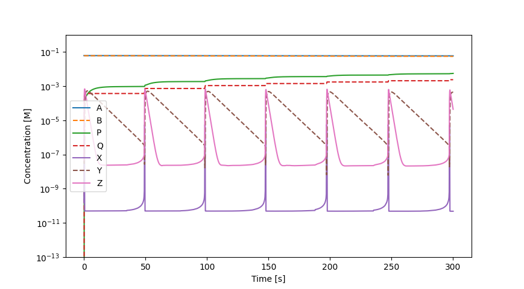

# Excercise 3: Kinetic simulations
This folder contains solutions to the tasks given in excercise 3.

### A note on numerical integration methods
It would be silly to use my own Python implementation of numerical integration when SciPy provides a wrapper for the Fortran odepack library. The recommended function for integrating differential equations is `scipy.integrate.solve_ivp`, and it offers both explicit and implicit methods with adaptive step.

In all imaginable cases, the odepack implementation will be superior to any Python implementation in both accuracy and performance.

## Protein folding
Firstly, this problem can be solved analytically using the equilibrium constants:

$$K^i(\text{[urea]}) = \frac{k_f^i(\text{[urea]})}{k_u^i(\text{[urea]})}$$

The equilibrium can be described using the following equations:

$$
K^{R15} = \frac{[I]}{[D]} \\
K^{R16} = \frac{[N]}{[I]} \\
\left[D\right] + [I] + [N] = 1
$$

The last equation normalizes the concentrations so that the resulting concentrations are equal to the fractional concentrations.

The solution to this system of equation is:

$$
    [D] = \frac{1}{1+K^{R15}+K^{R15}\cdot K^{R16}} \\
    \left[I\right] = K^{R15}\cdot [D] \\
    \left[N\right] = K^{R16}\cdot [I]
$$

### Solution using numerical integration
The same results can be also obtained by integrating the system of differential equations describing the kinetics and taking the concentrations at $t \rarr \infty $. In practice this is not possible, so a large value is chosen instead like $t = 10^6 \text{ s}$.

Because the equations are very stable after some initial time, the integration step becomes large and the integration finishes very quickly even if $t_\text{max} = 10^6 \text{ s}$.

### The code
All the code for protein folding kinetics is in `protein_folding/`.

I chose to have the rate constants and other coefficients saved in `constants.py` file - this is easily human-readable and editable, and no parsing is required.

To get the exact solutions, run `python exact_solution.py`.

To get the solution using numerical integration, run `python iterative_solution.py`.

Both scripts finish very quickly and produce the same graph.


## The Oregonator
The trick to solving very stiff differential equations which span several orders of magnitude is to integrate the logarith of the variables. The equations then become:

$$
\ln(r_1) = \ln(k_1) + \ln[A] + \ln[Y] \\
\frac{d\ln[A]}{dt} = \frac{d[A]}{dt}\frac{1}{[A]} = \exp\left(\ln(r_1)-\ln[A]\right) \\
...
$$

Using these equations, it is easy to solve for $\ln[A]$, $\ln[B]$, etc., and the values can be easily converted to $[A]$, $[B]$, etc. afterwards.

Because this is still a stiff equation, it is neccessary to use implicit integration method.

### The code
The code for solving the Oregonator equations is in `oregonator/`. The constants and differential equations are defined in `equations.py`.

The code can be run using `python solve.py`. The resulting plot should look somethind like this:



## Simulating diffusion
The diffusion can be described by the following partial differential equation:

$$\frac{dc(t,x)}{dt} = - \alpha\cdot\nabla^2c(t,x)$$

Where $\nabla^2$ is a Laplacian in the spatial dimension. Using finite differences, the Laplacian can be approximated using convolution. The convolution filters in 1D and 2D are:

$$
\left(-1,2,1\right) \\
\begin{pmatrix}
0 & -1 & 0 \\
-1 & 4 & -1 \\
0 & -1 & 0 \\
\end{pmatrix}
$$

A simple simulation of diffusion in 1D and 2D can be found in `diffusion/diffusion_1D.py` and `diffusion/diffusion_2D.py`. The simulations assume closed finite container. The initial state is hard-coded, but can be easily changed in the code and the solution is general.

For most initial conditions, diffusion is non-stiff problem, so explicit integrator can be used.

## Simulating chemical reaction and diffusion together
Firstly, it is important to discuss the hardware requirements for different approaches.

If the target resolution is 256x256 spatial pixels and we simulate two chemical species, each iteration takes up $256 \cdot 256 \cdot 2 \cdot 4 = 2^{19} \approx 500 \text{ kB}$. Thus, even if we neglect any resources needed for the calculation, a laptop with 16 GB RAM can store only cca 32k iterations.

Next problem arises with stiff equations. Stiff equations, like the Oregonator system, must be solved using implicit integrator to achieve any reasonable accuracy. However, explicit integrators need to calculate the inverse of the Jacobian matrix, in the aforementioned scenario, the Jacobian is a $(256\times 256\times 2)\times (256\times 256\times 2)$ matrix which would take up over 68 GB.

Although there might be some trick for solving this, I instead chose to replace the Oregonator system with more stable system. Specifically, I chose the Lotka–Volterra equations which can be solved with high-order explicit Runge-Kutta integrator.

I believe that the Lotka–Volterra equations are similar enough to the Oregonator or to the Belousov–Zhabotinsky reaction to capture at least the qualitative nature of the problem.

### The code
The code for this simulations is in `diffusion/belousov_zhabotinsky_reaction.py`. You can run the code as follows:

```
python diffusion\belousov_zhabotinsky_reaction.py [output_file.mp4] [resolution] [duration]
    [output_file.mp4] - the file where the final animation will be saved
    [resolution] - the resolution of the spatial dimensions, e.g. 64 will simulate 64x64 pixels
    [duration] - the number of the simulated frames
```

Example output: 
```
C:\excercise3_kinetics>python diffusion\belousov_zhabotinsky_reaction.py animation.mp4 64 1000
Solving equations...
Finished in 0:00:07.304474
The solver successfully reached the end of the integration interval.
Saving the animation...
Animation saved
```

Command used to generate the example animation:
```
C:\excercise3_kinetics>python diffusion\belousov_zhabotinsky_reaction.py diffusion\animation.mp4 512 2000 
Solving equations...
Finished in 0:17:23.321399
The solver successfully reached the end of the integration interval.
Saving the animation...
Animation saved
```
The example animation can be found in `diffusion/animation.mp4`.